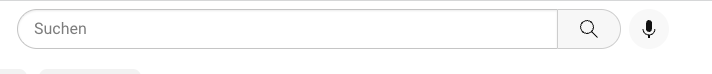
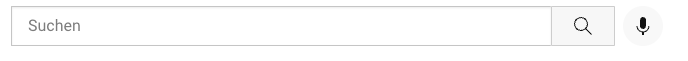
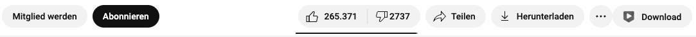
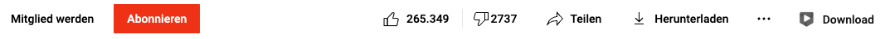

# ReturnBoxes
**[Features](#Features)**\
**[What on earth does this do?](#what-on-earth-does-this-do)**\
**Chrome: [How to install](#chrome-tutorial-)**\
**FireFox addon store: [How to install](#via-addonmozillaorg)**\
**FireFox temporary addon: [How to install](#via-temporary-extensions)**

### Features
- Better thumbnails
- Better description
- Red subscribe button (that also makes almost every other important button red, not the normal ones.)
- Better subscribe popup
- Better searchbox
- Title has normal font again
- Background of normal buttons transparent (like in the old layout)
- Dark mode compatibility
- and a lot more...

### Extension support
* YTDL Fox (YouTube Downloader Foxified)
   - Fixed download button
   - Made download button fit into the theme

### What on earth does this do?
Let me explain... With pictures!\

## How to install
### Chrome tutorial:
   Step 1: Get the latest release\
   Step 2: Unzip the source code\
   Step 3: Go to `chrome://extensions` in your Chrome browser\
   Step 4: Click on `Developer mode` and make sure it turns on\
   Step 5: Click `Load unpacked extension`\
   Step 6: Go into the **UNZIPPED** extension's folder\
   Step 7: **CLICK** on the folder called `chrome`(!!!)\
   Step 8: Click `Done`

### FireFox tutorial:
#### Via `addon.mozilla.org`
`Link coming soon!`
#### Via temporary extensions
**Warning:** If you do it this way, you'll have to do this again every time you restart/start firefox, due to firefox disabling the extension then! We recommend using the [webstore method](#via-addonmozillaorg-).\
   Step 1: Get the latest release\
   Step 2: Unzip the source code\
   Step 3: Go to `about:debugging#/runtime/this-firefox`\
   Step 4: Click on `Load temporary addon...`\
   Step 5: Go into the **UNZIPPED** extension's folder\
   Step 6: **CLICK** on the folder called `firefox`(!!!)\
   Step 7: Click `Done`
